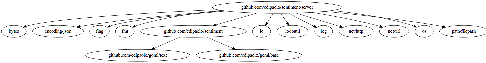

## Sentiment Server
### Web Server For Performing Sentiment Analysis

Sentiment Server performs modular sentiment analysis as a drop-in, easy, open source solution. Getting responses is as easy as `POST /analysis`. The cool part is that you can add in hooks to APIs upon which you can make abbreviated requests. See [hooks](#hooks) for details.

The server uses [this library](http://github.com/cdipaolo/sentiment) for sentiment analysis. Problems with the sentiment engine itself should be registered there. The model is a Naive Bayes classifier trained on the train set from the MDB movie review corpus (about 85,000 words!)

The server is _fast_! A simple benchmark of the `POST /analyze` endpoint (run `go test -bench .` in the project dir) gives an average time at the server of 1.0996ms, including routing, calculating sentiment, etc. for a few paragraphs from a Paul Graham essay with individual analysis for words and sentences as well as the document as a whole on a 2014 Macbook Air with iTunes, Chrome, a terminal, and a bunch of daemons (including Postgres) running. These are all the directly imported dependencies:



### Installation

```bash
$ go get github.com/cdipaolo/sentiment-server
$ go install github.com/cdipaolo/sentiment-server

# assuming $GOPATH/bin is in your $PATH
$ sentiment-server -C=/path/to/my/configuration
2015/07/31 00:30:45 Listening at http://127.0.0.1:8080 ...
```

<a id="hooks"></a>
### Hooks

Hooks let you specify URLs which you can GET from to retrieve text for sentiment analysis. This could be, for example, resources on a company server which need special headers (for auth, etc,) or any other service you don't want to deal with munging through requests every time you make a request.

Hooks are pretty simple. They hold a URL which can be formatted with Golang's `fmt.Sprintf` (basically just have one `%v` in there... eg `http://jsonplaceholder.typicode.com/posts/%v`,) any special headers you need to pass (headers are a `map[string][]string`,) and a key you want to identify the hook with when you request the `POST /task` endpoint.

Note that if you don't specify a key, the response will be assumed to be in plain text format (the resp.Body will be the analyzed text.)

If you want, you may specify a default header so you don't need to tell the API which hook you want each time. This is dont in the config file. If you only specify one hook this will default to be the hook given.

### Config

Example Config:

```json
{
    "port": 8080,
    "hooks": {
        "post": {
            "url": "http://jsonplaceholder.typicode.com/posts/%v",
            "key": "body",
            "headers": {
                "Auth": ["abcdefg"],
                "Another-Header": ["Hello!"]
            }
        },
        "comment": {
            "url": "http://jsonplaceholder.typicode.com/comments/%v",
        }
    },
    "defaultHook": "comment"
}
```

## Endpoints

### POST /analyze

General text classification. Pass it some body of text in the expected format and it will output the estimated sentiment. Sentiment values are returned on the range [0,1]. For Individual words, the score is the probability that the word is positive. For sentences and the score of the whole document, the value is returned as a descrete value in {0,1}. This is to prevent float underflow by using logarithmic sums (which predict the same output but won't give a clean probability number.) 

Note that all text is converted to lowercase and only letters in a-z are kept (numbers, etc. are taken out.)

**Expected JSON**

```json
{
    "text": "I'm not sure I like your tone right now. I do love you as a person, though."
}
```

**Returned JSON**

```json
{
  "words": [
    {
      "word": "im",
      "score": 0.5
    },
    {
      "word": "not",
      "score": 0.4675036438319862
    },
    {
      "word": "sure",
      "score": 0.4648956356736243
    },
    {
      "word": "i",
      "score": 0.5
    },
    {
      "word": "like",
      "score": 0.4444105070250458
    },
    {
      "word": "your",
      "score": 0.43021812378081226
    },
    {
      "word": "tone",
      "score": 0.5729166666666666
    },
    {
      "word": "right",
      "score": 0.5149606299212599
    },
    {
      "word": "now",
      "score": 0.5145454545454546
    },
    {
      "word": "i",
      "score": 0.5
    },
    {
      "word": "do",
      "score": 0.5
    },
    {
      "word": "love",
      "score": 0.6674710424710425
    },
    {
      "word": "you",
      "score": 0.4928460025767953
    },
    {
      "word": "as",
      "score": 0.5
    },
    {
      "word": "a",
      "score": 0.5
    },
    {
      "word": "person",
      "score": 0.47062750333778364
    },
    {
      "word": "though",
      "score": 0.5446105072463768
    }
  ],
  "sentences": [
    {
      "sentence": "im not sure i like your tone right now",
      "score": 0
    },
    {
      "sentence": " i do love you as a person though",
      "score": 1
    }
  ],
  "score": 1
}
```

### POST /task

This calls GET requests to the configured hooks. It allows you to specify the filler id number (called `recordingId` for legacy reasons) which will be formatted into the [hook's](#hooks) URL. It will then return the analysis (same response structure as `POST /analyze`) of the text returned from the request.

Note that you can omit the `hookId` to just use the default hook instead.

**Expected JSON**

```json
{
    "recordingId": "17",
    "hookId": "comments"
}
```

**Returned JSON**

```json
{
  "words": [
    {
      "word": "this",
      "score": 0.4972343525245145
    },
    {
      "word": "is",
      "score": 0.5
    },
    {
      "word": "an",
      "score": 0.5
    },
    {
      "word": "awesome",
      "score": 0.66134524907
    },
    {
      "word": "day",
      "score": 0.5019843751948
    }
  ],
  "score": 1
}
```

## LICENSE - MIT

See [LICENSE](LICENSE)
